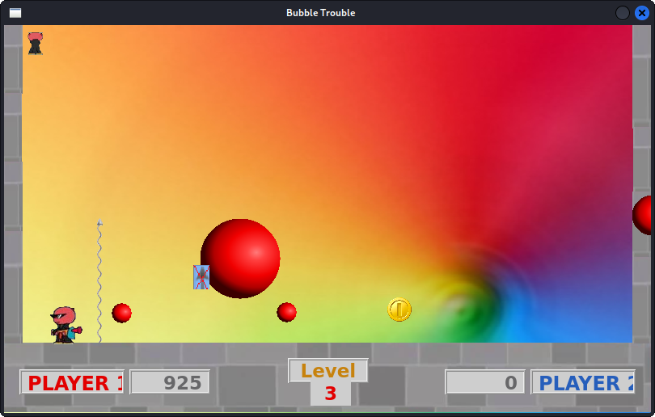

## To run the game:
1. Setup a virtual environment 
	e.g. `virtualenv venv`
2. Activate and install dependencies in it
	e.g. `source venv/bin/activate` `pip install -r requirements.txt`
3. Execute from base directory: `python3 TestClient/Menu.py`

